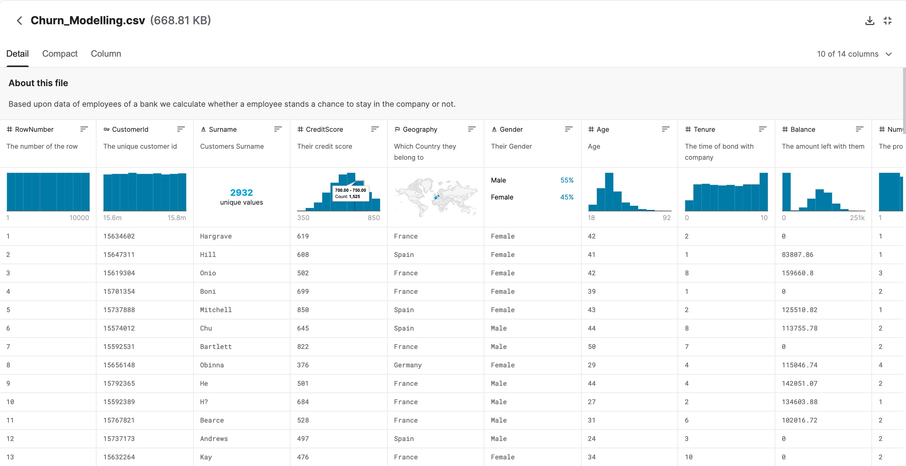

### Business Analytics A - Use Case
**[...back to use case list](/../../blob/main/README.md)**

# 007 - Parquet File Viewer
**Summary:** Implement a web service to display and analyze files in
the popular Parquet data file format. 

### 1. Use Case Classification
**Complexity:**  medium complex use case with focus data processing 
and web data visualization. 

**Challenges:** Parquet file format, Pandas, PyArrow, 
Commandline parsing, tabular and chart data visualization.

**Team setup:** 2 to 3 students.

### 1. Purpose
>Support the data format of the future (Data Scientist's *Liebling*)! 

**Me:** *Can't see what's inside this f *** Parquest file. Please show me!*   

**You:** *No problem, I'm a Python hero!*

### 2. Functional Requirements / Expected Results
Create a command line tool, named **parquetviewer.py** that... 

1. ...takes a (a) valid parquet file name or (a) a path to a folder containing 
   multiple partial parquet files representing one logical file as an argument.

2. ...spins up a server and web page to view and basic analysis and navigate of 
   the parquet file.
   
   **Viewing/Analysis:**
   - a spreadsheet grid to display the file contents (paging required)
   - some information about the file (size, columns, etc.)
   - some information about each column (data type, number of distinct values, etc.)
   - suitable visual chart-summary for each column.
    
   **Navigation:**
   - Filtering over individual columns (as in an Excel table object). Either 
     by values or by wildcard operations e.g.: "Mercedes C*"

3. ...supports for a help function to advice users on tool usage by entering 
   **'parquetviewer.py /help'** or ** 'parquetviewer.py /h'** on Windows or respective
   **'parquetviewer.py --help'** or  ** 'parquetviewer.py --h'** on Mac/Unix.

     
### 3. Success Criteria
A GitHub repository (public or private) that everyone can clone/download and that
directly starts up after the requirements listed in ***requirements.txt*** are fulfilled.

### 4. To get you started...
 - Apache Parquet file format: 
   - https://en.wikipedia.org/wiki/Apache_Parquet
   - https://parquet.apache.org/  
 - Start here: https://github.com/vipinc007/ParquetViewer
 - Web and API development with Python: https://flask.palletsprojects.com/  
 - The follwing screenshot is a good visual blueprint. See table visualization on: https://www.kaggle.com/shubh0799/churn-modelling
 

